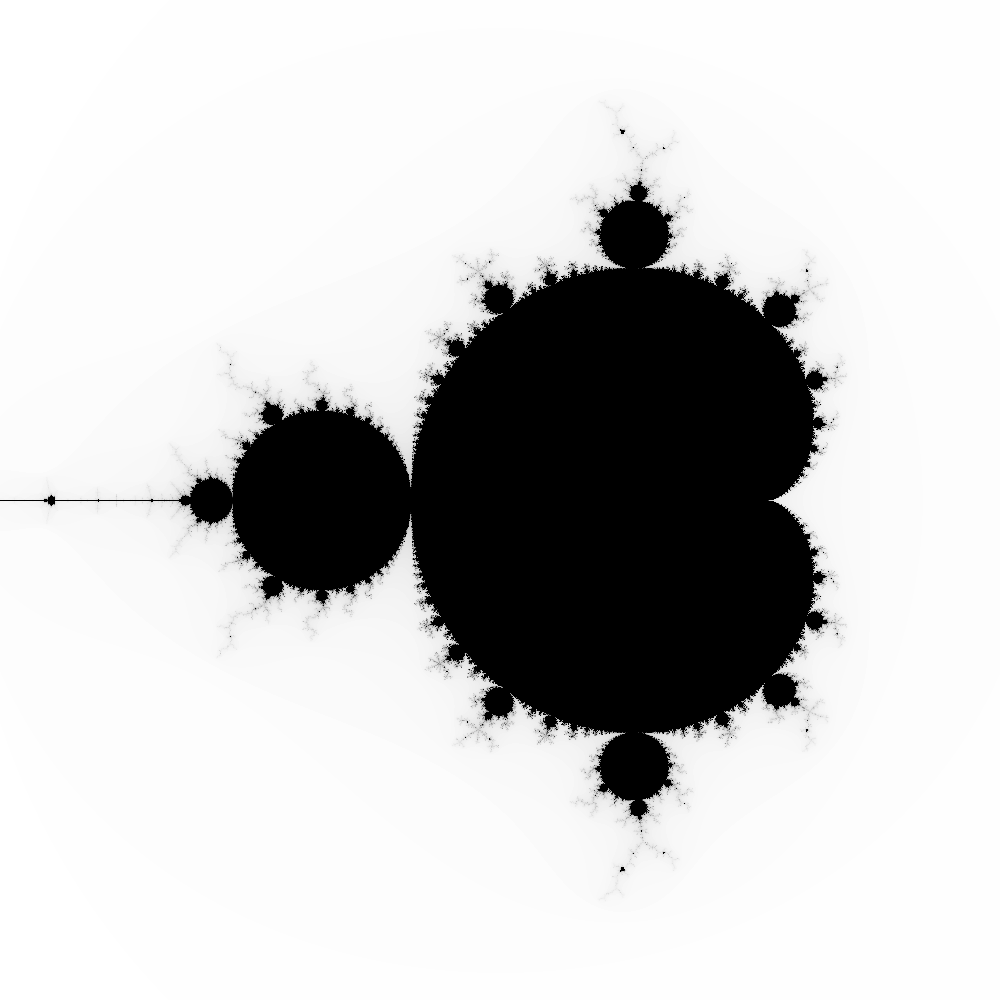
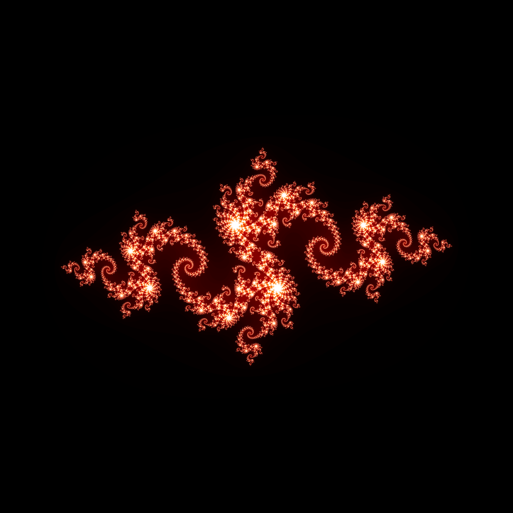

# julia
To build the project, run:
```bash
Make all
```

To create a Julia set plot, run:
```bash
./julia.sh 0.0 0.0 2.0 1000 200 -0.4 0.6
```

This will create an output png centered at (0.0,0.0) with a radius of 2, with a resolution of 1000x1000, run at 200 max iterations per pixel, and c = -0.4 + 0.6i.

To create a Mandelbrot set plot, run:
```bash
./mandelbrot.sh 0.0 0.0 2.0 1000 200
```

This will create an output png centered at (0.0,0.0) with a radius of 2, with a resolution of 1000x1000, and run at 200 max iterations per pixel.

The output images are placed into the pics/ directory. The scripts julia.sh and mandelbrot.sh automatically open their output in the default image view with the open command. This command works for macOS, but will have to be changed for other operating systems.

You can change the color map in display.py.

Requires python3, numpy, and matplotlib.





